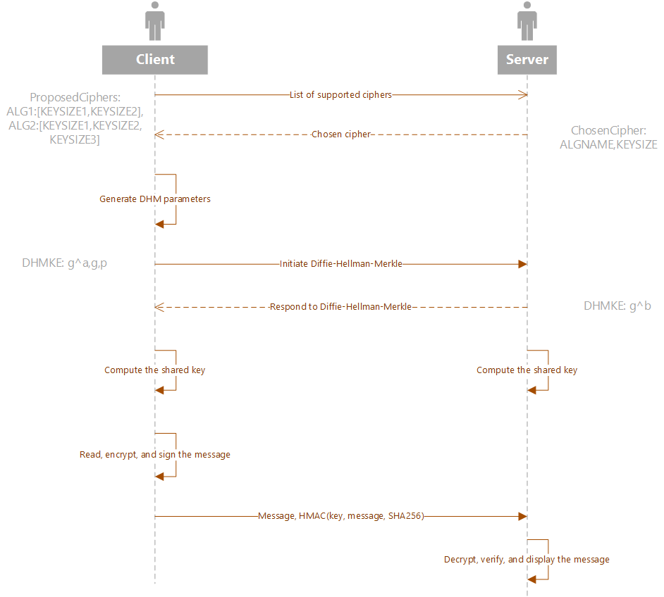

# Virtual Private Network (VPN)

## Philosophy
A [Virtual Private Network](https://en.wikipedia.org/wiki/Virtual_private_network) enables users to send and receive data across a shared or public network as if their devices were directly connected through a private network. This project is a proof of conecpt of a simple VPN server and client exchange data through an encrypted private network and data transferred between node A and B without being decipherable by external parties. 



*Figure 1: Procedural Diagram of VPN Data Exchange*

## Algorithm

### 1. Establishing a Connection

During boot, the server listens for a connection, and a client requests to connect to a the server, after which the two nodes negotiate on a cipher out of supported ciphers. These include (128 192, 256)-bit AES, (112, 224, 448)-bit Blowfish, and 56-bit DES encryption.

### 2. Diffie-Hellman Key Exchange

After negotiating possible ciphers, the client / server pair generate private and public key pairs, hashes the keys, and uses [Diffie Hellman key exchange](https://en.wikipedia.org/wiki/Diffie%E2%80%93Hellman_key_exchange) to exchange each other's public and private keys and establish authenticity. 

### 3. Data Transfer

The server will then listen for any incoming requests. The user will be prompted for a message and any input will be transferred from the client to a server. Upon reception of the data, the server will validate the [HMAC](https://en.wikipedia.org/wiki/HMAC) hash and display the data on the console.

## Running the Server

Make sure all the required modules are installed. Using `python3` run the `server.py` and `client.py` in different terminal windows.


### Installing Requirements on a Virtual Environment
```bash
python3 -m venv .venv
source .venv/bin/activate
pip install -r requirements.txt
```
### 

### Running the Server

```bash
$ python3 server.py
```

### Running the Client

```bash
$ python3 client.py
```
